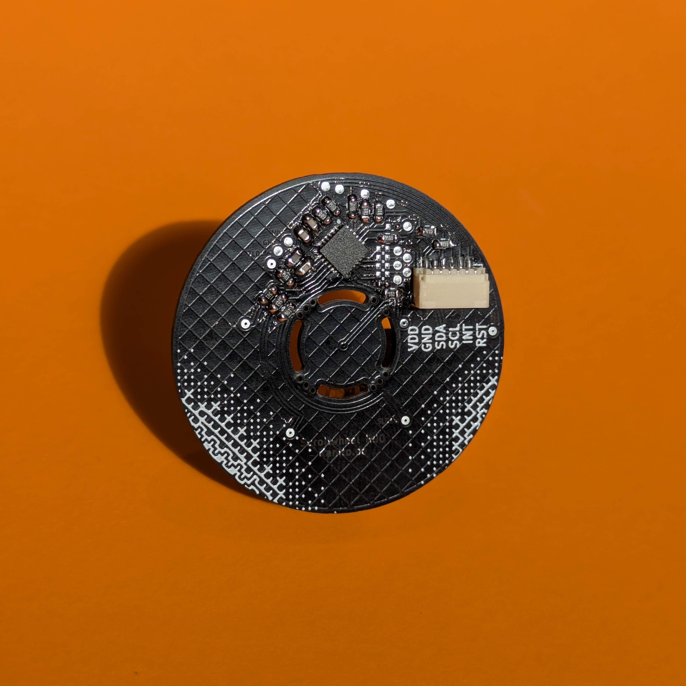
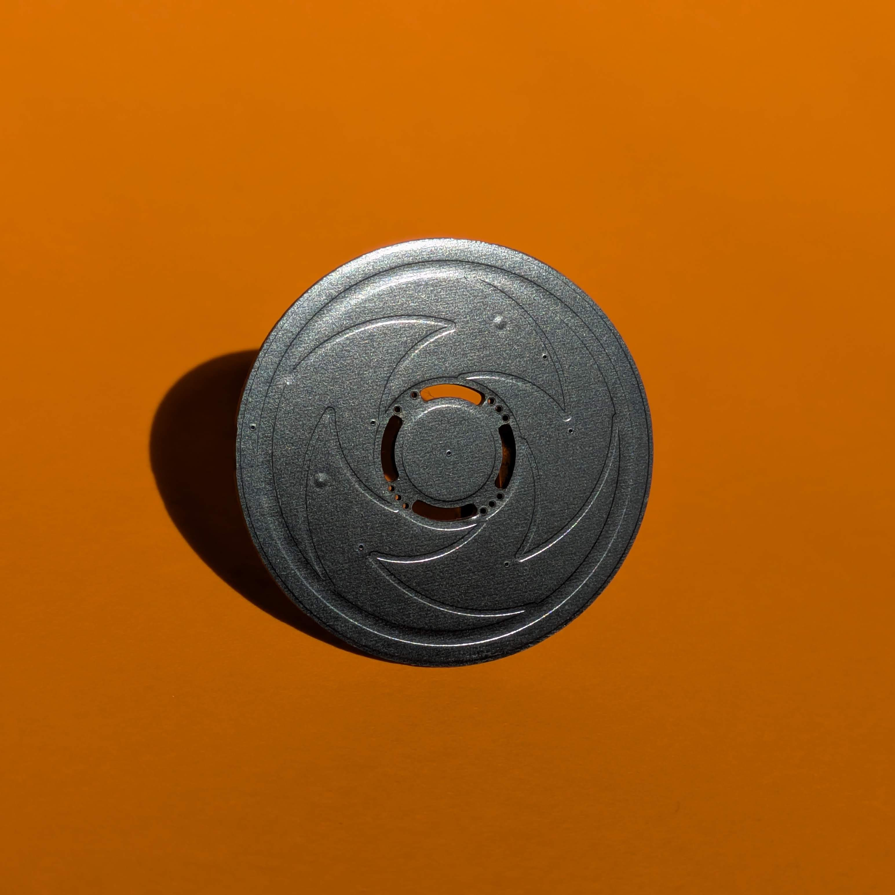
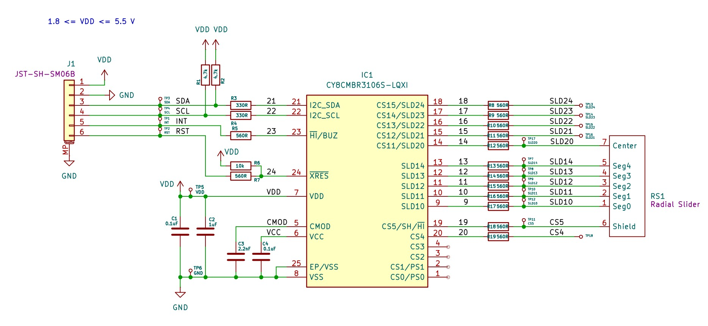
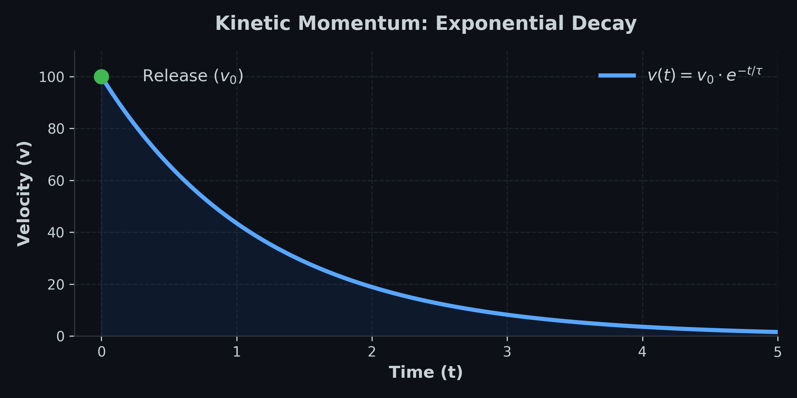
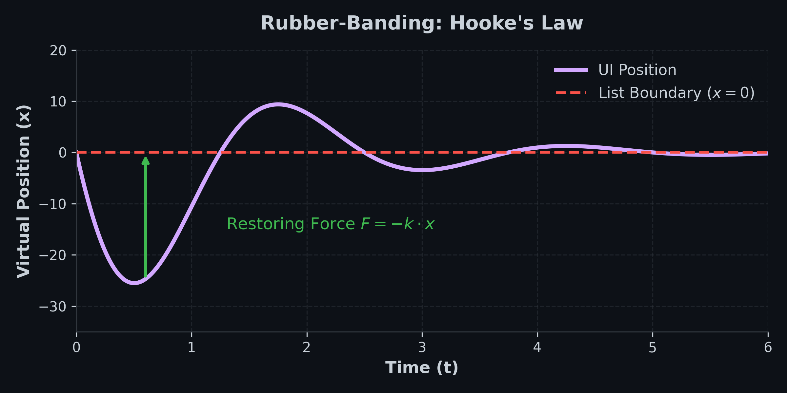

# Scrollwheel (CY8CMBR3106S)

A custom-designed, highly responsive capacitive radial slider PCB based on the Cypress CY8CMBR3106S touch controller. 

I built this project to bring professional, smooth, and latency-free rotational input to custom hardware interfaces. While the hardware provides solid raw data through a 5-segment slider and a central touch button, the real magic happens in the software. This repository contains both the hardware documentation and a robust C++ library to read and process the sensor data.

## Hardware Overview & Dimensions

The board is designed to be compact and easy to integrate into custom panels. It connects via a standard 6-pin JST-SH (1.0mm pitch) connector.






[](https://www.tindie.com/stores/kanito/?ref=offsite_badges&utm_source=sellers_Kanito&utm_medium=badges&utm_campaign=badge_small)

### Example Wiring (Arduino Uno / Nano)

To quickly test the Scrollwheel with a standard Arduino Uno or Nano, wire the JST-SH connector as follows:


| |Scrollwheel Pin | Arduino Pin | Notes |
|:---|:---|:---|:---|
| **1** |`(VDD)` | `5V` | The CY8CMBR3106S operates up to 5.5V. |
| **2**  | `(GND)` | `GND` | Common ground. |
| **3** |`(SDA)` | `A4` | I2C Data.  |
| **4** |`(SCL)` | `A5` | I2C Clock. |
| **5** |`(INT)` | `D2` | Hardware interrupt (maps to standard Arduino Interrupt 0). |
| **6** |`(RST)` | `D4` | Optional. Software-controlled reset. |

## Demonstration

Here is a quick look at the sensor in action, showing the raw input translated into smooth UI kinematics.


## Installation and Usage

This library is designed to work seamlessly with both the Arduino IDE and PlatformIO.

### Arduino IDE

**Installation:**
1. Download this repository as a `.zip` file by clicking on "Code" -> "Download ZIP" at the top of the page.
2. Open the Arduino IDE.
3. Navigate to **Sketch** -> **Include Library** -> **Add .ZIP Library...**
4. Select the downloaded `.zip` file.

**Running the Examples:**
1. Once installed, go to **File** -> **Examples** -> **Scrollwheel** (you will find it towards the bottom under "Examples from Custom Libraries").
2. Select either `01_Basic_RawData` or `02_Advanced_Gestures`.
3. Connect your board, select the correct COM port, and click **Upload**.
4. Open the Serial Monitor and ensure the baud rate is set to `115200`.

### PlatformIO

**Installation:**
The easiest way to include this library in a PlatformIO project is to add it via the `platformio.ini` file. Add the following line to your environment configuration:

```ini
lib_deps = https://github.com/Silas-Hoerz/Scrollwheel.git
```
Alternatively, you can manually download the repository and place the entire Scrollwheel folder into your project's local lib/ directory.

**Running the Examples:**
Unlike the Arduino IDE, PlatformIO requires a dedicated main.cpp file to compile a project. To run the included examples:

1. Navigate to the installed library folder (either in .pio/libdeps/ or your local lib/Scrollwheel/ folder) and open the examples directory.

2. Open the desired example file (e.g., 01_Basic_RawData.ino) and copy its entire contents.

3. Open your project's src/main.cpp file, delete its current contents, and paste the copied example code.

4. Ensure that the very first line of your main.cpp is #include <Arduino.h> (the Arduino IDE adds this silently behind the scenes, but C++ requires it explicitly).

5. Add monitor_speed = 115200 to your platformio.ini file to configure the serial monitor.

6. Build and upload the project using the PlatformIO toolbar.

## Web Demo

This repository includes a standalone, browser-based UI to visually test the Scrollwheel in real-time. It uses the modern Web Serial API, meaning **no additional software or drivers** are required. 

The UI automatically detects whether you are running the `01_Basic_RawData` or the `02_Advanced_Gestures` sketch and adjusts its physics engine and data readouts accordingly.

### How to use the Web UI:
1. Upload one of the example sketches to your Arduino and close the Serial Monitor (the COM port must be available).
2. Due to browser security restrictions regarding the Web Serial API, you cannot open the HTML file directly via `file:///`. You must serve it over a local web server.
3. Open a terminal in the `tools/WebUI/` folder (or wherever you placed the `index.html`).
4. Start a quick local server. If you have Python installed, simply run:
   ```bash
   python -m http.server
    ```
5. Open your Chromium-based browser (Chrome, Edge, Opera) and navigate to http://localhost:8000.

6. Click Connect to Arduino, select your COM port, and spin the wheel!

---

## Appendix: The Mathematics of Smooth UI 😵‍💫

Getting raw angles from a capacitive sensor is easy. Making it feel like a premium, professional interface requires solving several physical and mathematical problems. The `02_Advanced_Gestures` example implements five core algorithms to achieve this.

### 1. The Jitter-Latency Dilemma
**The Problem:** Capacitive sensors inherent electrical noise. A standard low-pass filter eliminates this jitter, but introduces noticeable lag when moving your finger quickly.

**The Solution:** The 1-Euro Filter (Adaptive Low-Pass).

It dynamically adjusts its cutoff frequency based on the speed of movement. When moving slowly, the filter is strong (eliminating noise). When moving quickly, the filter opens up entirely, dropping latency to zero. 

The filter uses exponential smoothing:

$$
\hat{X}_i = \alpha X_i + (1 - \alpha) \hat{X}_{i-1}
$$

The smoothing factor $`\alpha`$ is derived from a dynamic cutoff frequency $`f_c`$, which scales with velocity $`|\dot{\hat{X}}_i|`$:

$$
f_c = f_{c_{min}} + \beta |\dot{\hat{X}}_i|
$$

### 2. The Derivative Explosion
**The Problem:** To calculate UI momentum, we need angular velocity. Calculating simple differences over tiny time steps causes the velocity value to spike randomly due to sensor noise.

**The Solution:** Linear Regression (Savitzky-Golay principle).

Instead of looking at just the last two points, we take a rolling window of the last 5 points and calculate the slope of the line of best fit. This yields a silky-smooth velocity reading unaffected by single-point anomalies. We solve the overdetermined system using least squares:

$$
m, c = \text{argmin}_{m,c} \sum (y_i - (m \cdot x_i + c))^2
$$

### 3. Kinetic Momentum (Flicking)
**The Problem:** When you release the wheel after spinning it fast, the UI should not stop abruptly, nor should it scroll forever. It needs simulated friction.

**The Solution:** Exponential Decay.





Upon release, the algorithm captures the exit velocity $`v_0`$. The virtual list continues to move, but its velocity decays exponentially over time based on a tunable friction constant $`\tau`$:

$$
v(t) = v_0 \cdot e^{-t / \tau}
$$

### 4. Hard Stops (Rubber-Banding)
**The Problem:** Reaching the end of a virtual list shouldn't feel like hitting a brick wall. 

**The Solution:** Hooke's Law.





We allow the virtual scroll position to shoot past the 0 or maximum index. Once out of bounds, a virtual spring pulls the list back to the edge. The restoring force $`F`$ is proportional to the distance $`x`$ it traveled out of bounds:

$$
F = -k \cdot x
$$

### 5. The Wrap-Around Problem
**The Problem:** The hardware outputs absolute angles from 0 to 359 degrees. Crossing the 12 o'clock mark causes a massive jump between 359 and 0, which would launch the UI wildly.

**The Solution:** Circular Difference Accumulation.

By comparing the current frame to the last frame, we only look at the delta. If the delta is physically impossible for one frame (e.g., > 180 degrees), we know a boundary was crossed and mathematically correct it before adding it to an infinite continuous counter.

---

## License
This project is licensed under the MIT License. Feel free to use the hardware design and software in your own projects.

## Important Legal Notice & Disclaimer
For Professional and Educational Use Only

This product is an electronic component / evaluation board intended solely for development, prototyping, and educational purposes. It is NOT a finished consumer product.

Operation: It is designed to be integrated into larger systems by qualified personnel or electronics enthusiasts.

Compliance: As a sub-component, it has not undergone specific CE, FCC, or similar certification testing. The integrator (you) is responsible for ensuring the compliance of the final device.

Safety: This board operates at low voltage (max 5.5V). However, improper wiring or use can damage the sensor or connected hardware.

WEEE/EAR: In accordance with European regulations (ElektroG), this item is classified as a "component" and therefore does not fall under the registration requirements for finished electrical devices.

By purchasing or using this hardware, you acknowledge that you have the technical knowledge to handle electronic components safely.By purchasing or using this hardware, you acknowledge that you have the technical knowledge to handle electronic components safely.
=======
>>>>>>> 079f89983daf2b791ce2e3e206fea7e30d04a73d
